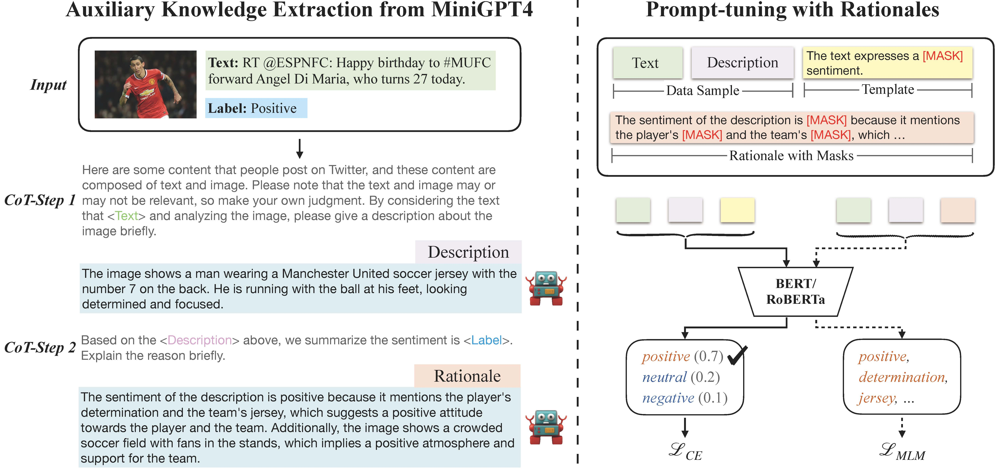

# Enhancing Multimodal Sentiment Analysis via Learning from Large Language Model 

# Running The Code
## Dependency
Some important packages are listed as follows.
```
python == 3.7
pytorch == 1.13.1
transformers == 4.22.2
numpy == 1.21.6
```
## Data 
We have provided the data of Twitter-15, Twitter-17, MVSA-Single and MVSA-Multiple.
You don't need the images to run the code in the repo.

## Generating Auxiliary Knowledge
You can leverage the CoT prompting approach, as outlined in our paper, to utilize [miniGPT-4](https://minigpt-4.github.io/) for knowledge generation, including image descriptions and rationales.

## Training \& Evaluation
The training/eval scripts are very straightforward, and follow the same structure.
Looking at `main.py` as a concrete example, all you need to do are to change the config.ini and run the code:
```python
python main.py
```

# Citations
If you found this paper useful, citing the paper and dataset would be greatly appreciated.
```
@inproceedings{DBLP:conf/icmcs/PangWHXYQ24,
  author       = {Ning Pang and
                  Wansen Wu and
                  Yue Hu and
                  Kai Xu and
                  Quanjun Yin and
                  Long Qin},
  title        = {Enhancing Multimodal Sentiment Analysis via Learning from Large Language
                  Model},
  booktitle    = {{IEEE} International Conference on Multimedia and Expo, {ICME} 2024,
                  Niagara Falls, ON, Canada, July 15-19, 2024},
  pages        = {1--6},
  publisher    = {{IEEE}},
  year         = {2024}
}
```

